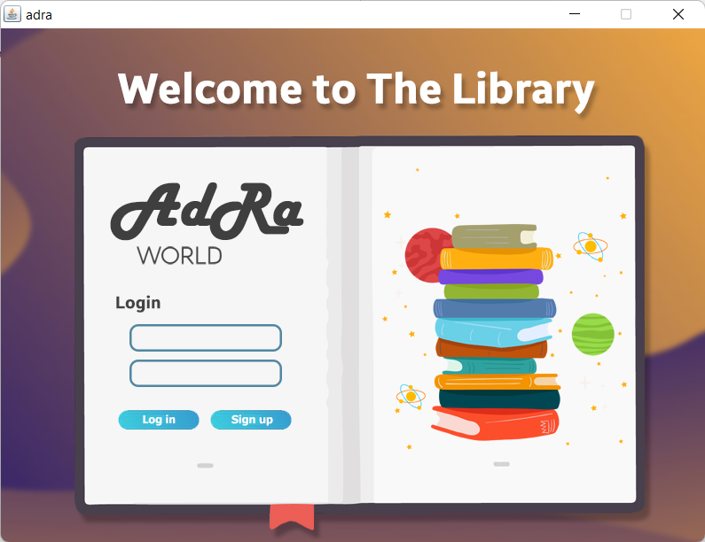
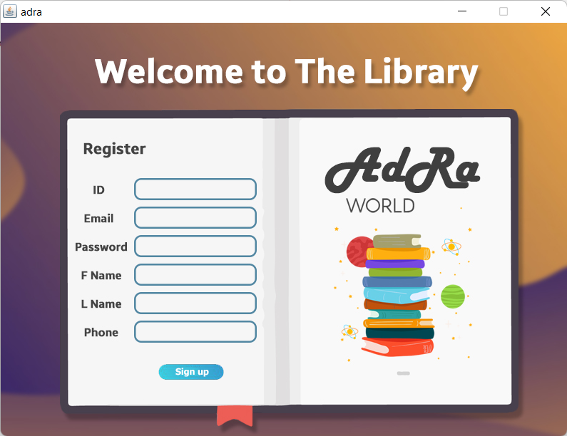
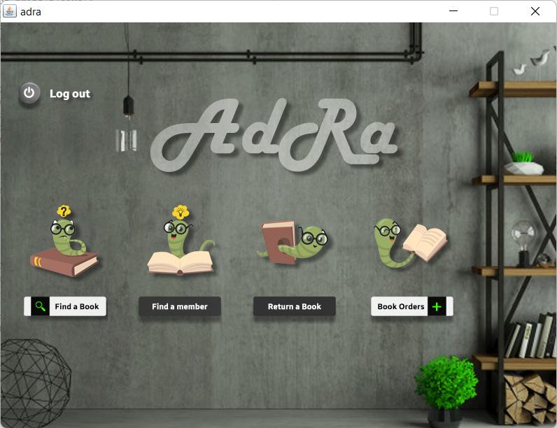
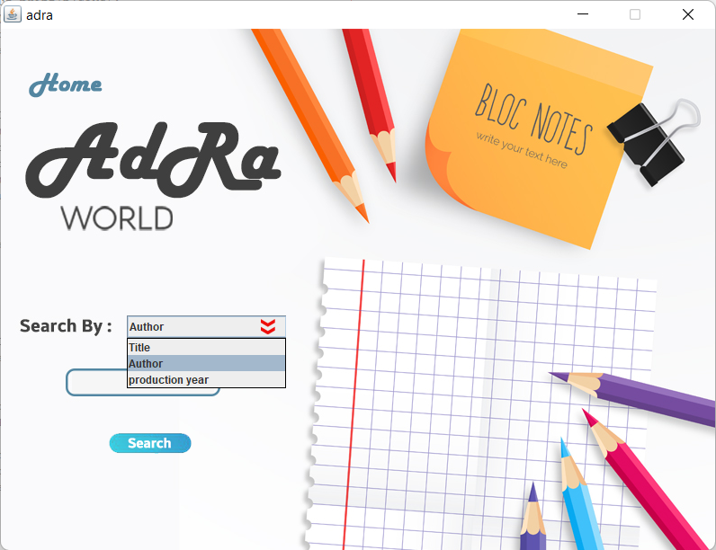
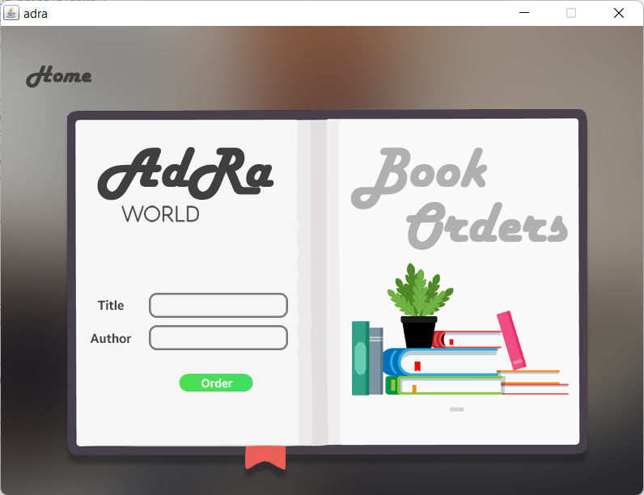
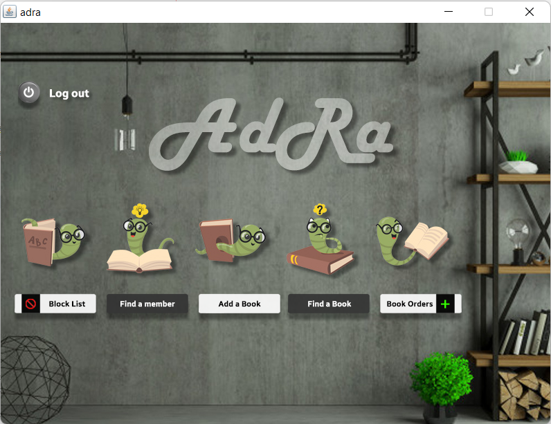
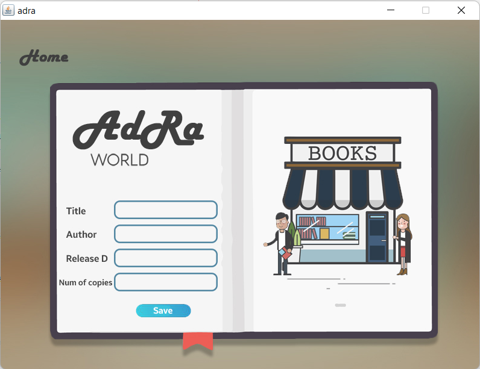

# Adra-Library-system
 AdRa is a library management system which allows you to manage your library members & book order requests, Also it allows the members to order or find a book using multiple ways of searching, This system is built using java connected to mysql database
 

 

